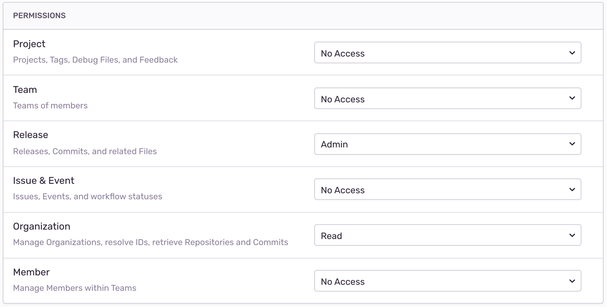
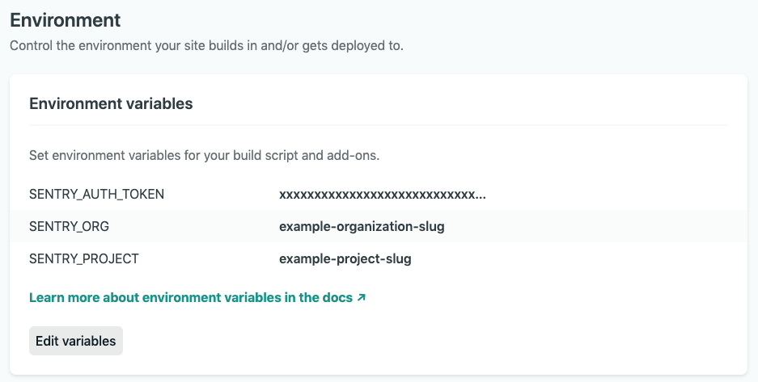

# Sentry Netlify build plugin &nbsp;&nbsp;&nbsp;<a href="https://app.netlify.com/start/deploy?repository=https://github.com/getsentry/sentry-netlify-build-plugin"></a>

Automatically upload source maps and notify [Sentry](https://sentry.io/) of new releases being deployed to your site after it finishes building in Netlify.

The Sentry Netlify build plugin:
* Notifies Sentry of new releases being deployed.
* Uploads source maps to Sentry.
* Sends Sentry the commit SHA of HEAD to enable commit features.

Before proceeding, you'll first want to ensure that your Sentry project is set up properly to track commit metadata. The easiest way to do that is to [install a repository integration](https://docs.sentry.io/workflow/releases/?platform=python#install-repo-integration).

Make sure build plugins are enabled on your site to see the plugin run.

## Installation
#### UI Installation
To install plugins via the Netlify UI, go to your team sites list and select the Plugins tab (or follow this direct link to the [plugins directory](https://app.netlify.com/plugins)). Then find "Sentry Build Plugin" and click **Install**.

UI installation is the recommended way to install this Build Plugin unless you need advanced configuration.

#### File-based Installation
Alternatively, to install with file-based installation, add the following lines to your `netlify.toml` file:

```toml
[[plugins]]
  package = "@sentry/netlify-build-plugin"

  [plugins.inputs]
    sentryOrg = ""
    sentryProject = ""
```

Note: The `[[plugins]]` line is required for each plugin installed via file-based installation, even if you have other plugins in your `netlify.toml` file already.

### Create a Sentry Internal Integration
For Netlify to communicate securely with Sentry, you'll need to create a new internal integration. In Sentry, navigate to: *Settings > Developer Settings > New Internal Integration*.

Give your new integration a name (for example, “Netlify Deploy Integration”) and specify the necessary permissions. In this case, we need Admin access for “Release” and Read access for “Organization”.



Click “Save” at the bottom of the page and grab your token, which you’ll need this in the next step.


### Set Environment Variables in Netlify
Save the internal integration token and any other environment variables as [site environment variables](https://docs.netlify.com/configure-builds/environment-variables/):
1. In Netlify, go to your site's settings.
2. Click on "Build & deploy".
3. Click “Edit variables” and add `SENTRY_AUTH_TOKEN`, `SENTRY_ORG`, and `SENTRY_PROJECT` with their respective values. For more configuration options see the [environment variables](#environment-variables) section below.
4. Click "Save".



For more information about the parameters below, please see the [Sentry release management docs](https://docs.sentry.io/cli/releases/).

### Ensure Your SDK is Configured
To link errors with releases, you must include a release ID (a.k.a version) where you configure your client SDK. For more information, read our documentation on [configuring your SDK for releases](https://docs.sentry.io/workflow/releases/?platform=node#configure-sdk).

#### Environment Variables

You can use [site environment variables](https://docs.netlify.com/configure-builds/environment-variables/) to configure these values:
| name | description | default |
|------|-------------|---------|
| `SENTRY_AUTH_TOKEN` | Authentication token for Sentry. | - |
| `SENTRY_ORG` | The slug of the organization name in Sentry. | - |
| `SENTRY_PROJECT` | The slug of the project name in Sentry. | - |
| `SENTRY_RELEASE` | The release ID (a.k.a version). | [COMMIT_REF](https://docs.netlify.com/configure-builds/environment-variables/#git-metadata) |
| `SENTRY_ENVIRONMENT` | The name of the environment being deployed to. | Netlify [deploy context](https://docs.netlify.com/site-deploys/overview/#deploy-contexts) |
| `SENTRY_RELEASE_PREFIX` | Set this to prefix the release name with the value. | - |


#### Plugin Inputs
| name | description | default |
|------|-------------|---------|
| `sentryOrg` | The slug of the organization name in Sentry. | - |
| `sentryProject` | The slug of the project name in Sentry. | - |
| `sentryAuthToken` | Authentication token for Sentry. We recommend this be set as an environment variable (see below). | - |
| `sentryRelease` | The release ID (a.k.a version). | [COMMIT_REF](https://docs.netlify.com/configure-builds/environment-variables/#git-metadata) |
| `sourceMapPath` | Folder in which to scan for source maps to upload. | Netlify publish directory |
| `sourceMapUrlPrefix` | Prefix for the location of source maps. | `"~/"` |
| `skipSetCommits` | Set this to true if you want to disable commit tracking. | `false` |
| `skipSourceMaps` | Set this to true if you want to disable sending source maps to Sentry. | `false` |
| `releasePrefix` | Set this to prefix the release name with the value. | - |
| `deployPreviews` | Set this to false if you want to skip running the build plugin on deploy previews. | `true` |
